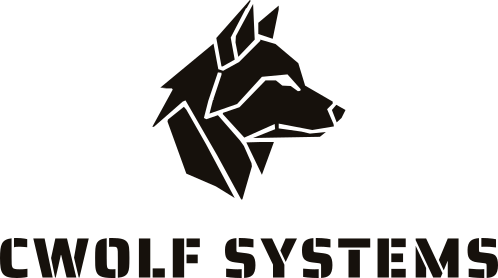

<p align="center">
  <picture>
    <source media="(prefers-color-scheme: dark)" srcset="docs/assets/cwolf-logo-light-text.svg">
    
  </picture>
</p>

# playwright-cesium

[](https://github.com/cwolf-systems/playwright-cesium/actions/workflows/ci.yml)
[](https://github.com/cwolf-systems/playwright-cesium/actions/workflows/ci.yml)
[](https://www.npmjs.com/package/@cwolf-systems/playwright-cesium)

Playwright helpers for testing CesiumJS scenes: know when a scene has finished drawing, hold time
and the camera still, step frames exactly, find places on the canvas, and read its pixels back.

Built for teams testing CesiumJS applications, where the usual waits are wrong. In 33 measured
runs across Chromium and WebKit, `networkidle`, which CesiumJS's own suite waits on, captured an
unfinished scene 10 times, a 5-second sleep 6 times, and `settled()` never. How long a scene takes
also varies widely: from about 1 s to 40 s on GitHub's runners, by browser and platform.

> **Early release.** What is described here works and is tested. Still to come: assertions about
> where entities are drawn and how they move.

## Install

```bash
npm install --save-dev @cwolf-systems/playwright-cesium
```

It requires `@playwright/test` 1.53 or later, and works with the CesiumJS build your application
already ships.

## Quick start

```ts
import { expect, test } from '@cwolf-systems/playwright-cesium';

test('mission view', async ({ page, cesium }) => {
  await page.goto('/viewer');
  const scene = await cesium.attach('window.viewer');
  await scene.settled();
  await expect(page).toHaveScreenshot();
});
```

`settled()` waits on Cesium's own signals rather than the network, and fails with what was still
loading if it runs out of time.

## Guarantees

- **Settles on Cesium's own signals.** Terrain, globe and 3D Tiles loaded, no requests in flight,
  entities built, primitives, model textures and billboard images ready, no camera flight running
  and fonts loaded, across consecutive frames. It watches the frames Cesium
  renders, adding its own only when Cesium renders none. A timeout names what was still loading; a
  render error fails at once with Cesium's message.
- **Frames on request.** A virtual frame clock makes time and animation frames move only when a
  frame is stepped, and seeds `Math.random`, so Cesium's per-frame budgets and timers repeat from
  run to run.
- **No Cesium dependency.** It runs against whatever CesiumJS build the application ships.
- **An offline demo.** A real CesiumJS scene built from the `cesium` package and a generated 3D
  Tiles tileset; its tests fail if any request leaves the local server.
- **Platforms measured, not assumed.** What each browser can do for CesiumJS on Linux (x64 and ARM),
  macOS and Windows is measured (`bench/platforms.mjs`) and published, including where it cannot
  run at all.
- **Tested where it runs.** Chromium and WebKit on Linux, macOS and Windows on every commit, and the
  oldest and newest Playwright it supports; Firefox is measured weekly but not yet tested on each
  commit. A browser that cannot run CesiumJS is skipped with the reason, never passed silently.

## Learn more

- [Using playwright-cesium](docs/guides/usage.md): attaching, settling, time and the virtual clock,
  the camera, places on the canvas, pixels, options and errors.
- [Accuracy](docs/benchmarks/accuracy.md): whether each way of waiting captures the finished scene,
  against `networkidle`, fixed sleeps and identical screenshots.
- [Platforms](docs/benchmarks/platforms.md): WebGL support, renderers and settle times for each
  browser on each platform, and what they mean for a test suite.
- [ARCHITECTURE.md](ARCHITECTURE.md).

## Development

Node 20 or later.

```bash
npm ci
npm run build
npm run typecheck
npm run lint
npm run test:coverage
npm run test:browser
npm run bench:accuracy
npm run bench:platforms
npm run test:count
```

## Licence

Apache License 2.0; see [LICENSE](LICENSE) and [NOTICE](NOTICE). The CWOLFSYSTEMS name and logo are
not covered by the licence.
